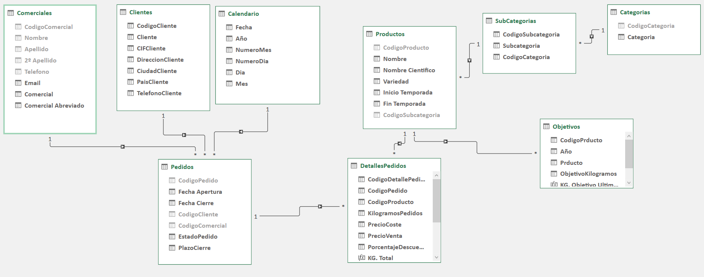
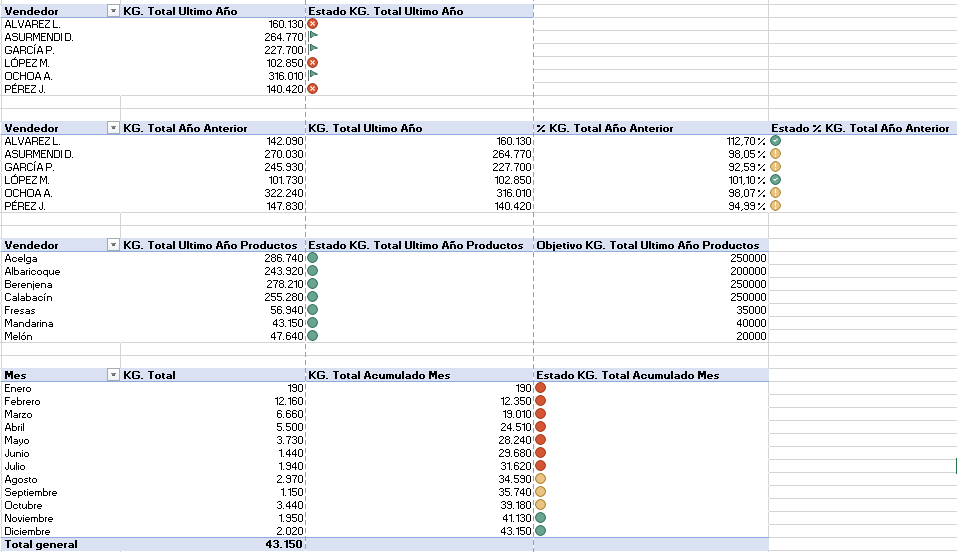
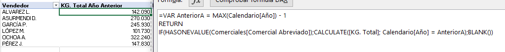
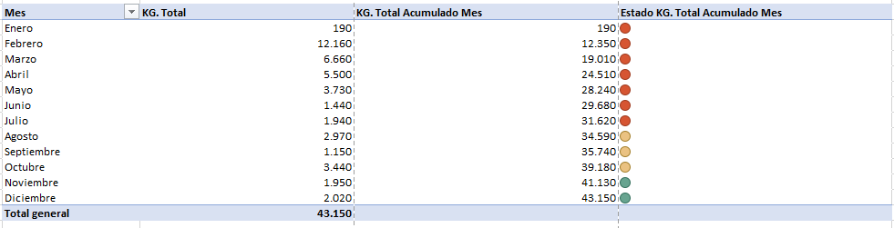

# Dashboard de KPIs Financieros y Comerciales — Excel

> Proyecto de práctica en análisis de datos y seguimiento de objetivos comerciales usando Microsoft Excel avanzado.

---

## Herramienta utilizada: Microsoft Excel

Excel es una de las herramientas más utilizadas en el mundo del análisis de datos y la gestión empresarial. En este proyecto se aprovecharon sus capacidades avanzadas para construir un sistema de control de KPIs (Key Performance Indicators) completamente funcional, sin necesidad de herramientas externas.

**¿Por qué Excel para este proyecto?**
- Permite construir dashboards interactivos con **Tablas Dinámicas** y **segmentadores**
- Soporta fórmulas condicionales para calcular estados de cumplimiento en tiempo real
- Es ampliamente adoptado en entornos empresariales, lo que lo hace ideal para reportes reproducibles
- Facilita la visualización rápida de métricas sin infraestructura adicional

---

## Objetivo del Proyecto

Crear un sistema de seguimiento de KPIs para una empresa del sector de distribución de productos agrícolas/alimentarios, que permita:

- Monitorear el desempeño de vendedores frente a sus objetivos de kilogramos vendidos
- Comparar el rendimiento del año actual vs. el año anterior
- Controlar el cumplimiento de metas por producto
- Visualizar la evolución mensual acumulada de ventas

---

## Estructura del Archivo

El archivo `KPI-Fin.xlsx` está organizado en **2 hojas de trabajo**:

### 1. `Control Objetivos` — Hoja principal del dashboard
Concentra todas las tablas dinámicas y métricas de control. Contiene 4 bloques de análisis:

| Bloque | Descripción |
|--------|-------------|
| **KG por Vendedor vs Objetivo** | Compara los kilogramos vendidos por cada vendedor contra su meta, con indicador de estado |
| **Variación Año Anterior por Vendedor** | Muestra el % de cumplimiento respecto al año anterior para detectar caídas o mejoras |
| **KG por Producto vs Objetivo** | Controla el rendimiento por tipo de producto (Acelga, Berenjena, Fresas, etc.) |
| **Evolución Mensual Acumulada** | Seguimiento mes a mes del acumulado de ventas para ver la progresión anual |

### 2. `Opciones` — Hoja de datos de soporte
Tabla maestra con los **objetivos de kilogramos por producto y año** (2018 y 2019), que alimenta los cálculos dinámicos del dashboard.

---

## Métricas y KPIs Calculados

```
✅ Estado por vendedor     →  Cumple / No cumple / En límite  (valores: 1 / -1 / 0)
📉 % vs Año Anterior       →  Variación porcentual interanual
📦 KG por Producto         →  Real vs Objetivo por categoría
📅 Acumulado Mensual       →  Progresión mes a mes durante el año
```

**Vendedores monitoreados:** Alvarez L. · Asurmendia D. · García P. · López M. · Ochoa A. · Pérez J.

**Productos monitoreados:** Acelga · Albaricoque · Berenjena · Calabacín · Fresas · Mandarina · Melón

---
## ¿Cómo se construyó?
---

## Paso 1 — Arquitectura del Modelo de Datos (Diagrama en Estrella)

Para procesar grandes volúmenes de información de manera óptima, el proyecto no utiliza buscarv tradicionales, sino que implementa un **Modelo de Datos Relacional** en Power Pivot optimizado bajo un **diseño en estrella**.

> 

### Estructura de las Tablas
El modelo separa claramente las actividades del negocio de sus entidades analíticas:

* **Tablas de Hechos (Fact Tables):** * `Pedidos` y `DetallesPedidos`: Registran las transacciones operativas diarias (fechas, kilogramos vendidos, precios y descuentos).
  * `Objetivos`: Almacena las metas de kilogramos planificadas por producto y año.
* **Tablas de Dimensiones (Dim Tables):** * `Calendario`, `Clientes`, `Comerciales`, `Productos`, `SubCategorias` y `Categorias`. Actúan como filtros lógicos del modelo.

### ¿Por qué es importante esta estructura?
* **Eficiencia y Escalabilidad:** Al conectar las tablas mediante relaciones cardinales (de 1 a varios `1:*`), el motor de almacenamiento de Excel (VertiPaq) comprime los datos, permitiendo trabajar con millones de filas sin ralentizar el archivo.
* **Filtros Cruzados Seguros:** Permite que cualquier segmentador (como el de *Año* o *Producto*) filtre correctamente las ventas y los objetivos al mismo tiempo, garantizando la consistencia de los reportes en el Dashboard.

### Paso 2 — Diseño de la estructura de datos
Se definió la hoja `Opciones` como tabla de configuración con objetivos por producto y año. Esto permite actualizar metas sin tocar la lógica del dashboard.

### Paso 3 — Creación de Tablas Dinámicas
Se construyeron **4 Tablas Dinámicas** independientes en la hoja `Control Objetivos`, cada una enfocada en una dimensión de análisis diferente (vendedor, producto, tiempo).

> 

### Paso 4 — Cálculo de estados con lógica condicional
Se implementaron columnas de **"Estado"** usando fórmulas `SI()` y comparaciones contra los objetivos de la hoja `Opciones`. El sistema de semáforo usa:
- `1` → Objetivo cumplido ✅
- `0` → En el límite ⚠️
- `-1` → Por debajo del objetivo ❌

### Paso 5 — Indicadores de comparación interanual
Se creó la columna `% KG Total Año Anterior` para calcular qué porcentaje del volumen anterior se está repitiendo en el año actual, permitiendo detectar caídas de rendimiento por vendedor.

> 

### Paso 6 — Control de evolución mensual
Se incluyó una tabla dinámica de seguimiento mes a mes con **acumulado progresivo**, útil para ver si el ritmo de ventas es suficiente para alcanzar el objetivo anual.

> 

---

## El Cerebro del Dashboard: Fórmulas DAX Avanzadas

El verdadero motor analítico de este proyecto es el uso de **DAX (Data Analysis Expressions)**. A diferencia de las fórmulas de celda comunes, las medidas DAX operan dinámicamente sobre el contexto de filtro seleccionado por el usuario en los segmentadores.

A continuación, se detallan las medidas clave creadas en Power Pivot:

| Medida DAX | Fórmula | Propósito y Utilidad Analítica |
| :--- | :--- | :--- |
| **KG. Total** | `CALCULATE(SUM(DetallesPedidos[KilogramosPedidos]), Pedidos[Fecha Apertura] <= NOW())` | **Cálculo Base Seguro:** Centraliza la suma total de kilos vendidos, asegurando mediante un filtro que solo se contabilicen transacciones históricas o hasta la fecha actual (`NOW()`). |
| **KG. Total Acumulado Mes** | `IF(HASONEVALUE(Calendario[Mes]), TOTALYTD([KG. Total], Calendario[Fecha]), BLANK())` | **Inteligencia de Tiempo (YTD):** Calcula la progresión acumulada de ventas mes a mes. Usa `HASONEVALUE` para ocultar filas vacías o totales innecesarios, manteniendo la estética del reporte. |
| **KG. Total Año Anterior** | `VAR AnteriorA = MAX(Calendario[Año]) - 1 RETURN IF(HASONEVALUE(Comerciales[Comercial Abreviado]), CALCULATE([KG. Total], Calendario[Año] = AnteriorA), BLANK())` | **Desplazamiento Temporal:** Captura dinámicamente el año seleccionado mediante variables (`VAR`) y viaja exactamente un año atrás en el tiempo para extraer las ventas del vendedor y permitir la comparación. |
| **KG. Total Ultimo Año Productos** | `VAR UltimoA = MAX(Calendario[Año]) RETURN IF(HASONEVALUE(Productos[Nombre]), CALCULATE([KG. Total], Calendario[Año] = UltimoA), BLANK())` | **Evaluación de Contexto por Producto:** Itera a nivel de fila sobre cada producto para traer las ventas del año máximo seleccionado en el filtro del reporte. |
| **% KG. Total Año Anterior** | `DIVIDE([KG. Total Ultimo Año], [KG. Total Año Anterior])` | **Métrica de Rendimiento (YoY):** Divide el volumen del año analizado entre el año previo. Usa `DIVIDE` en lugar del operador `/` para manejar matemáticamente de forma segura las divisiones por cero (`#DIV/0!`). |
| **KG. Objetivo Ultimo Año** | `VAR UltimoA = MAX(Calendario[Año]) RETURN IF(HASONEVALUE(Productos[Nombre]), CALCULATE(MAX(Objetivos[ObjetivoKilogramos]), Objetivos[Año] = UltimoA), BLANK())` | **Cruce Dinámico de Metas:** Viaja a la tabla independiente de objetivos para extraer la cuota asignada a ese producto específico durante el año analizado. |

### ¿Por qué es importante el uso de DAX aquí?
* **Cálculos Dinámicos No Estáticos:** Si el usuario cambia el año en el segmentador de `2018` a `2019`, las variables (`VAR`) recalculan instantáneamente el año anterior y los objetivos correspondientes en milisegundos.
* **Independencia de la Estructura de la Hoja:** Al estar integradas en el modelo de datos, si mueves, ordenas o cambias la disposición de las tablas dinámicas, los cálculos nunca se romperán (a diferencia de las fórmulas tradicionales de Excel que dependen de la posición de las celdas).  
---

## Habilidades demostradas

| Área | Detalle |
|------|---------|
| **Tablas Dinámicas** | Construcción, agrupación y relación entre hojas |
| **Fórmulas avanzadas** | Lógica condicional `SI()`, cálculos de variación porcentual |
| **Modelado de datos** | Separación entre datos de configuración y datos de análisis |
| **KPI Design** | Definición de métricas relevantes para la toma de decisiones |
| **Reporting** | Organización visual clara por bloques temáticos |

---

## Conclusiones

Este proyecto demuestra cómo Excel, bien estructurado, puede actuar como una herramienta de Business Intelligence básica. El sistema de semáforo, la comparación interanual y el acumulado mensual son patrones clásicos en reportes ejecutivos del mundo real.

